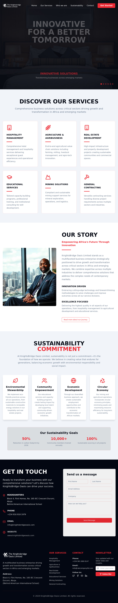
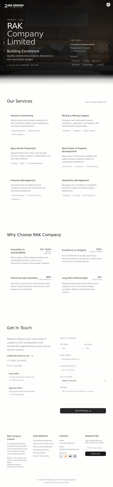

  <h3>🚀 I transform ideas into tech solutions that unlock new revenue streams and cut operational costs. Startup Engineering │ Workflow Optimization │ Consulting.</h3>

---

## 🎯 Professional Summary

> **Innovative Senior Full Stack Engineer** with **12+ years** of expertise in designing, developing, and optimizing enterprise-grade software solutions. Proven track record of **leading technical teams**, **driving digital transformation**, and delivering **high-impact systems** that scale to millions of users.

### 💼 Key Achievements

- 🔧 **40% improvement** in system scalability through microservices architecture
- ⚡ **60% reduction** in deployment time with CI/CD implementation
- 💰 **150% increase** in online sales through e-commerce platform optimization
- 🛡️ **75% fraud reduction** with blockchain-based supply chain solutions
- 👥 **Led and mentored a team of developers**, boosting team productivity by **30%**

---

## 💻 Technical Expertise

### **Core Technologies**

<!-- Skill icons provided by skill-icons. Full icon list and names:
     https://github.com/tandpfun/skill-icons?tab=readme-ov-file#icons-list -->

### **Cloud & DevOps**

  
  

### **Databases & Infrastructure**

 
 

### **Mobile & Emerging Tech**

---

## 🚀 Featured Projects

  <!-- Project 1 -->
  

    
    

      <h3 style="margin: 0 0 8px 0;">Koletmoni</h3>
      
A comprehensive digital platform designed to streamline operations and enhance user experience through innovative technology solutions.

      

        <a href="#" style="color: #0366d6; text-decoration: none; font-size: 14px;">🔗 Project</a>
        Web Development, Digital Solutions
      

    

  

  <!-- Project 2 -->
  

    
    

      <h3 style="margin: 0 0 8px 0;">InstantLearn</h3>
      
An educational platform revolutionizing learning with instant access to courses and interactive content for modern students.

      

        <a href="#" style="color: #0366d6; text-decoration: none; font-size: 14px;">🔗 Project</a>
        EdTech, E-learning, Interactive Platform
      

    

  

  <!-- Project 3 -->
  

    
    

      <h3 style="margin: 0 0 8px 0;">JobHunter</h3>
      
AI-powered career development platform helping job seekers optimize resumes and find opportunities with intelligent matching.

      

        <a href="https://jobhunteer.vercel.app" style="color: #0366d6; text-decoration: none; font-size: 14px;">🔗 Live Demo</a>
        AI, Career Development, ATS
      

    

  

  <!-- Project 4 -->
  

    
    

      <h3 style="margin: 0 0 8px 0;">Knightsbridge Oasis</h3>
      
A premium digital platform offering luxury services and experiences with elegant design and seamless user interface.

      

        <a href="#" style="color: #0366d6; text-decoration: none; font-size: 14px;">🔗 Project</a>
        Luxury Services, Web Application
      

    

  

  <!-- Project 5 -->
  

    
    

      <h3 style="margin: 0 0 8px 0;">RAK Company Ltd</h3>
      
Corporate website showcasing business solutions with professional design and comprehensive service offerings.

      

        <a href="#" style="color: #0366d6; text-decoration: none; font-size: 14px;">🔗 Project</a>
        Corporate, Business Solutions
      

    

  

  <!-- Project 6 -->
  

    
    

      <h3 style="margin: 0 0 8px 0;">Afripact</h3>
      
Revolutionizing education with data-driven insights and streamlined case management for educational institutions.

      

        <a href="https://admin.afripact.com" style="color: #0366d6; text-decoration: none; font-size: 14px;">🔗 Live Demo</a>
        Education, Data Analytics, Management
      

    

  

  <!-- Project 7 -->
  

    
    

      <h3 style="margin: 0 0 8px 0;">Airbnb Clone</h3>
      
A complete frontend clone of Airbnb built with Next.js, featuring modern design and responsive user interface.

      

        <a href="https://airbnbclone-lime-two.vercel.app" style="color: #0366d6; text-decoration: none; font-size: 14px;">🔗 Live Demo</a>
        Next.js, Clone, Responsive Design
      

    

  

  <!-- Project 8 -->
  

    
    

      <h3 style="margin: 0 0 8px 0;">MangoChat - Blockchain Chat</h3>
      
Secure blockchain-based messaging platform ensuring transparent and tamper-proof communication with modern UI/UX.

      

        <a href="https://meta-verse-challenge.vercel.app" style="color: #0366d6; text-decoration: none; font-size: 14px;">🔗 Live Demo</a>
        Blockchain, Web3, Security, Chat
      

    

  

  <!-- Project 9 -->
  

    
    

      <h3 style="margin: 0 0 8px 0;">Car Rental Application</h3>
      
User-friendly car rental platform with React.js, Redux, and modern web technologies for seamless booking experience.

      

        <a href="https://car-rent-seven.vercel.app" style="color: #0366d6; text-decoration: none; font-size: 14px;">🔗 Live Demo</a>
        React.js, Redux, Web Application
      

    

  

  <!-- Project 10 -->
  

    
    

      <h3 style="margin: 0 0 8px 0;">Qub Cloudify</h3>
      
Modern cloud management platform built with Next.js, offering seamless cloud resource management and deployment solutions.

      

        <a href="https://qub-cloudify.vercel.app/" style="color: #0366d6; text-decoration: none; font-size: 14px;">🔗 Live Demo</a>
        Next.js, Cloud, Web Application
      

    

  

  <!-- Project 11 -->
  

    
    

      <h3 style="margin: 0 0 8px 0;">Cloudax - Blockchain Ecosystem</h3>
      
Decentralized and scalable ecosystem powering the next generation of innovative web3 products and services.

      

        <a href="https://cloudaxwebsite.vercel.app/" style="color: #0366d6; text-decoration: none; font-size: 14px;">🔗 Live Demo</a>
        Blockchain, Web3, Decentralized
      

    

  

  <!-- Project 12 -->
  

    
    

      <h3 style="margin: 0 0 8px 0;">Smoothube - Video Streaming</h3>
      
Modern YouTube-inspired platform with Next.js, React, and Tailwind CSS featuring adaptive streaming and real-time communication.

      

        <a href="https://smoothube.vercel.app" style="color: #0366d6; text-decoration: none; font-size: 14px;">🔗 Live Demo</a>
        Next.js, React, Video Streaming, WebRTC
      

    

  

  <!-- Project 13 -->
  

    
    

      <h3 style="margin: 0 0 8px 0;">ReachOut World</h3>
      
A platform dedicated to spreading the Rhapsody of Reality globally, connecting communities and sharing inspirational content.

      

        <a href="https://reachoutworld.vercel.app/" style="color: #0366d6; text-decoration: none; font-size: 14px;">🔗 Live Demo</a>
        Community, Social Impact, Web Application
      

    

  

  <!-- Project 14 -->
  

    
    

      <h3 style="margin: 0 0 8px 0;">BH Music Player</h3>
      
Modern music streaming platform with a clean, responsive interface for discovering and playing music online.

      

        <a href="https://bhmusicplayer.vercel.app/" style="color: #0366d6; text-decoration: none; font-size: 14px;">🔗 Live Demo</a>
        Music, Streaming, React, Web App
      

    

  

  <!-- Project 15 -->
  

    
    

      <h3 style="margin: 0 0 8px 0;">Chat with PDF AI</h3>
      
AI-powered application that allows users to interact with PDF documents through natural language conversations.

      

        <a href="https://chat-with-pdf-challenge-five.vercel.app/" style="color: #0366d6; text-decoration: none; font-size: 14px;">🔗 Live Demo</a>
        AI, PDF, Chat, Next.js
      

    

  

  <!-- Project 16 -->
  

    
    

      <h3 style="margin: 0 0 8px 0;">Torain</h3>
      
Agricultural technology platform connecting farmers with markets and providing modern farming solutions.

      

        <a href="#" style="color: #0366d6; text-decoration: none; font-size: 14px;">🔗 Project</a>
        AgriTech, Farming, Marketplace
      

    

  

  <!-- Project 17 -->
  

    
    

      <h3 style="margin: 0 0 8px 0;">GetPower</h3>
      
Electricity service platform enabling users to purchase power conveniently with reliable and fast transactions.

      

        <a href="#" style="color: #0366d6; text-decoration: none; font-size: 14px;">🔗 Project</a>
        Electricity, Utility Services, Payments
      

    

  

  <!-- Project 18 -->
  

    
    

      <h3 style="margin: 0 0 8px 0;">Detroinic</h3>
      
Comprehensive digital solutions platform offering free usage models and innovative technology services.

      

        <a href="#" style="color: #0366d6; text-decoration: none; font-size: 14px;">🔗 Project</a>
        Digital Solutions, Technology Services
      

    

  

---

## 📚 Education & Certifications

### **Professional Development**

- **Full-stack Software Engineering** - JSM Masterclass Experience (2023)
- **Level 8 Diploma (Ph.D/DBA)** - Business Administration, Qualifi Ltd (2021)
- **Programming for Everybody (Python)** - University of Michigan
- **Creative Programming for Digital Media & Mobile Apps** - University of London
- **Startup Engineering** - Stanford University

### **Technical Certifications**

- **AWS Certified Solutions Architect**
- **Docker Certified Associate**
- **Kubernetes Application Developer**
- **MongoDB Certified Developer**
- **Professional Scrum Master (PSM)**

---

## 🏆 Awards & Recognition

- **🏆 Web/Mobile Developer of the Year 2023** - Presidential Award (Mid-Level)
- **🥇 Staff of the Year 2022** - Departmental Excellence Award
- **📈 Innovation Leadership Award** - Digital Transformation Excellence
- **👨‍💻 Technical Excellence Award** - Full Stack Development Innovation

---

## 📊 GitHub Statistics

  
  
  

---

## 🔗 Professional Network

  
[<picture><source media='(prefers-color-scheme: dark)' srcset='https://api.iconify.design/simple-icons/linkedin.svg?color=white&height=40'><source media='(prefers-color-scheme: light)' srcset='https://api.iconify.design/simple-icons/linkedin.svg?color=0077b5&height=40'></picture>](https://linkedin.com/in/emmacyril)
&nbsp;
[<picture><source media='(prefers-color-scheme: dark)' srcset='https://api.iconify.design/simple-icons/github.svg?color=white&height=40'><source media='(prefers-color-scheme: light)' srcset='https://api.iconify.design/simple-icons/github.svg?color=333&height=40'></picture>](https://github.com/emmacyril)
&nbsp;
[<picture><source media='(prefers-color-scheme: dark)' srcset='https://api.iconify.design/simple-icons/twitter.svg?color=white&height=40'><source media='(prefers-color-scheme: light)' srcset='https://api.iconify.design/simple-icons/twitter.svg?color=1da1f2&height=40'></picture>](https://twitter.com/cyrifi)
&nbsp;
[<picture><source media='(prefers-color-scheme: dark)' srcset='https://api.iconify.design/simple-icons/medium.svg?color=white&height=40'><source media='(prefers-color-scheme: light)' srcset='https://api.iconify.design/simple-icons/medium.svg?color=000&height=40'></picture>](https://dev.to/emmacyril)

---

## 🤝 Let's Connect

I'm passionate about **building innovative solutions**, **mentoring developers**, and **driving technical excellence**.

**Current Focus:** Cloud-native architectures, AI/ML integration, Web3 technologies, and scalable SaaS platforms.

**Open to:** Technical leadership roles, consulting opportunities, and collaborative projects that challenge the status quo.

---

  <i>💡 "Turning complex challenges into elegant, scalable solutions is not just my job—it's my passion."</i>
    
  <strong>📧 eminify+github@gmail.com</strong> | 
  <strong>🌐 [emmacyril.eminify.com](https://emmacyril.eminify.com/)</strong>

