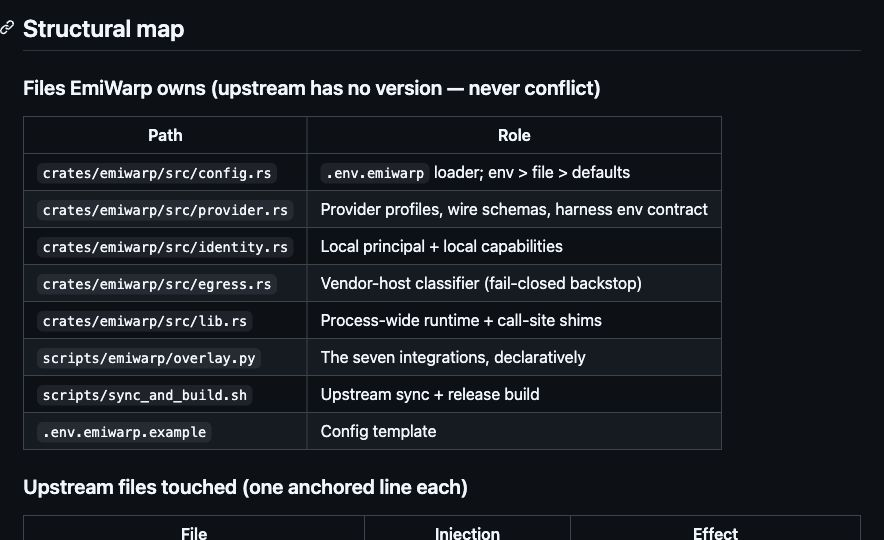
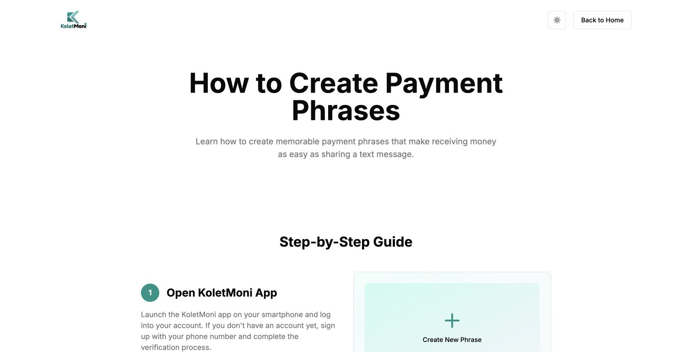
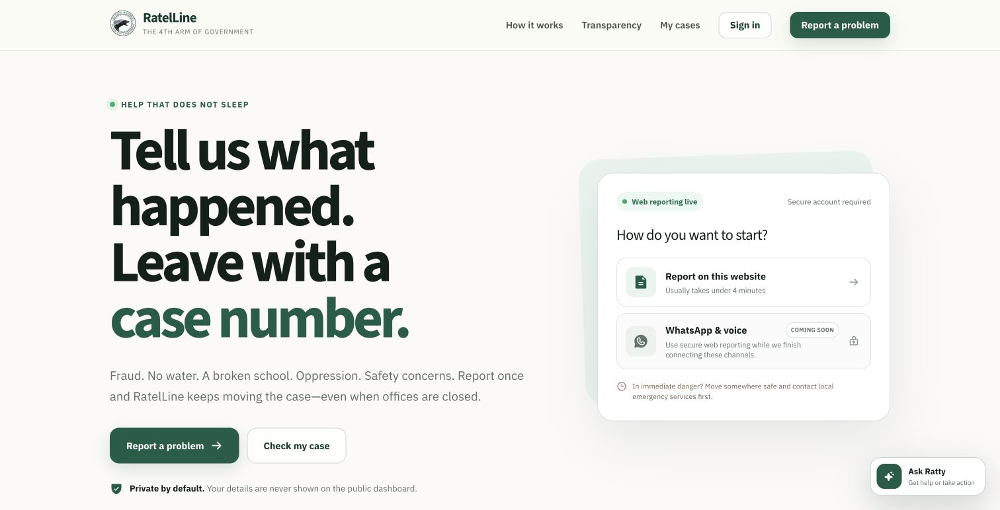
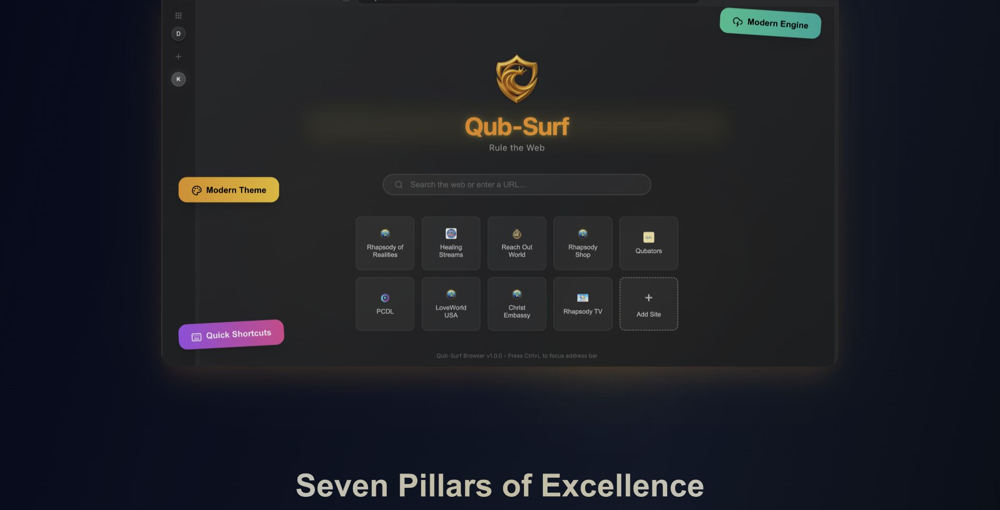
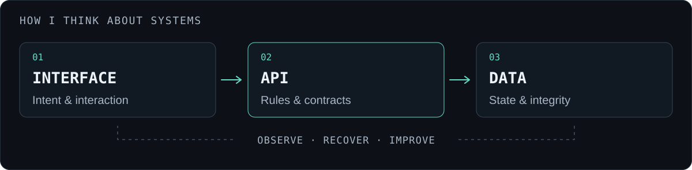
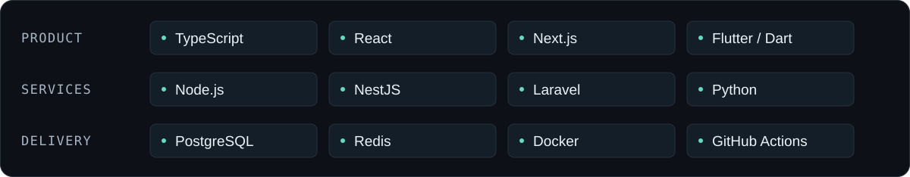
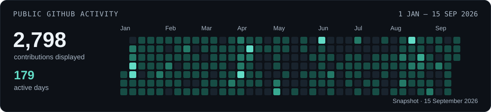

  

# Hi, I’m Cyril.

**Senior Product Engineer & Technical Lead · Founder, [Eminify](https://www.eminify.com/)**

I build **payments, identity and operational systems**—the interfaces, APIs and integrations that carry a request through to a dependable result. My background in institutional ICT keeps operations in view; building Eminify keeps the business problem in view.

Based in **Nigeria**, working with international teams. Interested in thoughtful engineering, useful products and long-term collaboration.

  
  
  
  

## What I build

<table>
<tr>
<td width="50%" valign="top">

<h3><a href="https://github.com/emmacyril/EMIWARP">EMIWARP ↗</a></h3>

<strong>Configurable AI terminal tooling</strong>

Agent-provider configuration, local-model discovery and runtime integration. A focused overlay built on <a href="https://github.com/warpdotdev/warp">Warp</a>.

Rust · Python · Shell Active development · Public source and documentation

</td>
<td width="50%" valign="top">

<h3><a href="https://www.koletmoni.com/">KoletMoni ↗</a></h3>

<strong>Payments across mobile and backend</strong>

Payment phrases, QR Cash, wallet journeys and provider integrations. My work spans Flutter clients, backend integration and API migration.

Flutter · Node.js · Laravel Product implementation · Public payment-phrase guide

</td>
</tr>
<tr>
<td width="50%" valign="top">

<h3><a href="https://ratel-line-frontend.vercel.app/">RatelLine ↗</a></h3>

<strong>AI-assisted case workflows</strong>

Web, mobile and API delivery for reporting and tracking civic cases, with permission-aware AI tools and human-approval boundaries.

NestJS · Next.js · Flutter · PostgreSQL In development · Public product demonstration

</td>
<td width="50%" valign="top">

<h3><a href="https://github.com/emmacyril/qubsurf">Qub-Surf ↗</a></h3>

<strong>Desktop browser engineering</strong>

Tab and window behaviour, navigation, workspaces and desktop packaging, built on the Electron/Chromium foundation.

Electron · Chromium · Application UI Desktop application work · Public docs; private implementation

</td>
</tr>
</table>

My broader work includes identity and document workflows at **AddressDox**, payment-platform engineering at **RewaPay**, and client delivery through **Eminify**. [Explore the wider portfolio →](https://emmacyril.eminify.com/)

## How I think about systems

The details matter: **permissions, duplicate requests, ledger integrity, provider failures, approvals and handover**. I use AI-assisted development alongside source review and hands-on implementation, and remain responsible for the work I deliver.

## Tools I work with

## Building, consistently

GitHub’s publicly displayed calendar · Snapshot captured 15 September 2026 · <a href="./assets/activity/public-calendar-2026.json">Source data</a> · <a href="https://github.com/emmacyril?tab=overview">Current activity</a>

## Connect around useful work

I welcome **engineering collaboration, product partnerships and practical technical conversations** with founders, teams and peers. A good starting point is a real system: its problem, architecture, trade-offs and the work still worth doing.

Engineering roles and leadership engagements

I consider **Senior Full-Stack / Product Engineer**, **Payments & Integrations Engineer**, **Technical Lead**, and **Solutions Architect** opportunities with AI, SaaS and fintech teams. For early-stage companies, I also consider **Fractional CTO / Hands-on Head of Engineering** engagements with a clear scope and delivery mandate.

[Portfolio](https://emmacyril.eminify.com/) · [LinkedIn](https://www.linkedin.com/in/emmacyril/) · [Email](mailto:eminify+github@gmail.com)
