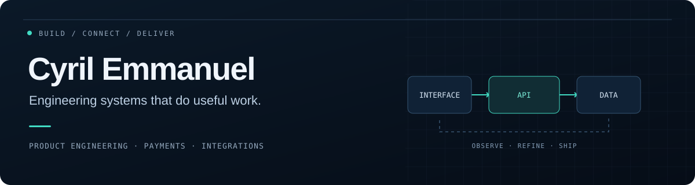

# Cyril Emmanuel

**Senior Full-Stack / Product Engineer · Payments & Integrations · Hands-on Technical Leadership**

I build the backends, interfaces and integrations that turn a business process into a usable product. My work spans payment workflows, identity and document systems, operational software, and AI-assisted applications.

Based in **Nigeria**. Founder of **[Eminify](https://www.eminify.com/)**. Open to relevant remote roles and relocation opportunities.

[Portfolio](https://emmacyril.eminify.com/) · [LinkedIn](https://www.linkedin.com/in/emmacyril/) · [Email](mailto:eminify+github@gmail.com)

## Where I contribute

- **Product engineering:** carry a feature from requirements through API design, web or mobile implementation, deployment and maintenance.
- **Payments and integrations:** connect providers, preserve transaction state, handle retries and reconciliation, and build the tools operators need when something goes wrong.
- **Technical delivery:** turn a broad brief into an achievable scope, explain architecture decisions, review implementation and plan releases.
- **Applied AI:** connect models to useful workflows with permissions, explicit tool boundaries and human handoff.

## Selected engineering work

### [EMIWARP](https://github.com/emmacyril/EMIWARP) — configurable AI terminal tooling

An open-source overlay built on **[Warp](https://github.com/warpdotdev/warp)**. My additions focus on agent-provider configuration, local model discovery, runtime integration and scripts that reapply the changes when upstream moves.

**Engineering focus:** Rust modules, Python tooling, provider boundaries and maintainable upstream integration. **Status:** active development; the repository documents the architecture and build requirements.

[Source and technical walkthrough](https://github.com/emmacyril/EMIWARP#readme)

### [KoletMoni](https://www.koletmoni.com/) — payments across mobile and backend

A payments product with memorable payment phrases, QR Cash, wallet journeys and bank/bill-provider integrations. My work spans Flutter clients, backend integration and API migration work.

**Engineering focus:** transaction lifecycle, duplicate-request handling, reconciliation and keeping mobile contracts consistent as the backend changes.

[Product website](https://www.koletmoni.com/)

### [RatelLine](https://ratel-line-frontend.vercel.app/) — AI-assisted case workflows

A web, mobile and API platform for reporting and tracking civic cases. The implementation combines a defined case lifecycle with an AI assistant whose tool calls pass through application permissions and human-approval boundaries.

**Engineering focus:** NestJS/Fastify, Next.js, Flutter, PostgreSQL, queues and permission-aware AI tools. **Status:** in development.

[Product demonstration](https://ratel-line-frontend.vercel.app/)

### [Qub-Surf](https://github.com/emmacyril/qubsurf) — desktop browser delivery

Desktop browser work built on the **Electron/Chromium** foundation: tab and window behaviour, navigation, application UI and desktop packaging. Product documentation and distribution information are public; the application source is maintained privately.

**Engineering focus:** desktop interaction, keyboard workflows and cross-platform application delivery.

[Public documentation](https://github.com/emmacyril/qubsurf) · [Product website](https://qubsurf.vercel.app/)

### Commercial platform work

My broader work includes proof-of-residence and document workflows at **AddressDox**, payment-platform engineering at **RewaPay**, and client web applications and integrations through **Eminify**. These projects are best discussed through the responsibilities, design decisions and permitted demonstrations relevant to the role.

## How I work

1. Map the user journey, data ownership and failure cases before choosing the implementation.
2. Define API contracts and transaction boundaries so clients and services can evolve predictably.
3. Test the failures that matter: duplicate requests, interrupted flows, authorization and recovery.
4. Leave the next engineer a clear handover: setup, operating notes, known limitations and release steps.

I use AI-assisted development alongside source review and hands-on implementation. I remain responsible for the decisions, integration and verification of the work I deliver.

## Core tools

| Area | Tools I work with |
| --- | --- |
| Web and product UI | TypeScript, JavaScript, React, Next.js, Tailwind CSS |
| APIs and services | Node.js, NestJS, Express, PHP/Laravel, Python/FastAPI |
| Mobile | Flutter/Dart, React Native |
| Data and delivery | PostgreSQL, MySQL, MongoDB, Redis, Docker, GitHub Actions |

## Let's discuss the work

I am interested in **Senior Full-Stack / Product Engineer**, **Payments & Integrations Engineer**, **Technical Lead**, and **Solutions Architect** opportunities with AI, SaaS and fintech teams. I also consider **Fractional CTO / Hands-on Head of Engineering** engagements with a clear scope and delivery mandate.

A useful first conversation is a walkthrough of a real system: the problem, the architecture, the tradeoffs, and what I implemented.

**[View my portfolio](https://emmacyril.eminify.com/)** · **[Connect on LinkedIn](https://www.linkedin.com/in/emmacyril/)** · **[Get in touch](mailto:eminify+github@gmail.com)**
