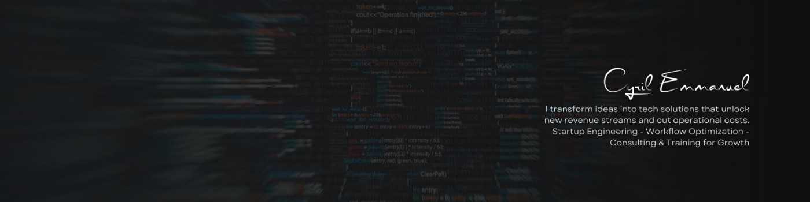
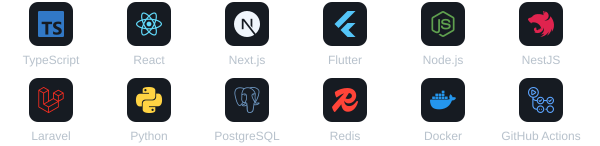
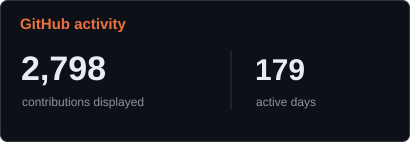
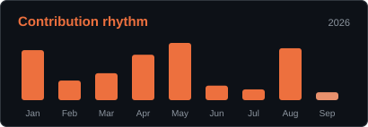

  

<h2 align="center">Hi, I’m Cyril Emmanuel 👋</h2>

<strong>Senior product engineer · Technical lead · Founder, Eminify</strong>

I engineer the systems behind the experience. Payments, identity, operational platforms and developer tools. Based in Nigeria, working with international teams.

<a href="https://emmacyril.eminify.com/">Portfolio ↗</a> &nbsp;·&nbsp; <a href="https://www.linkedin.com/in/emmacyril/">LinkedIn</a> &nbsp;·&nbsp; <a href="https://www.eminify.com/">Eminify</a> &nbsp;·&nbsp; <a href="mailto:emmacyril@gmail.com">Email</a>

<h3 align="center">Tech stack</h3>

<h3 align="center">GitHub activity</h3>

 

Publicly displayed calendar · 1 Jan–15 Sep 2026 · September is partial · <a href="./assets/identity/public-calendar-2026.json">Snapshot data</a> · <a href="https://github.com/emmacyril?tab=overview">Current activity</a>

### Selected work

- **[EMIWARP](https://github.com/emmacyril/EMIWARP)** — AI terminal integrations; an overlay built on [Warp](https://github.com/warpdotdev/warp).
- **[KoletMoni](https://www.koletmoni.com/)** — Flutter clients, payment flows and backend integrations.
- **[RatelLine](https://ratel-line-frontend.vercel.app/)** — AI-assisted case workflows across web, mobile and API; in development.
- **[Qub-Surf](https://github.com/emmacyril/qubsurf)** — Desktop browser engineering on Electron/Chromium; public docs, private source.

### How I think about systems

Permissions, duplicate requests, provider failures and handover matter as much as the interface.

Open to engineering collaboration, product partnerships and useful technical conversations. <a href="https://emmacyril.eminify.com/">Explore my wider work →</a>

