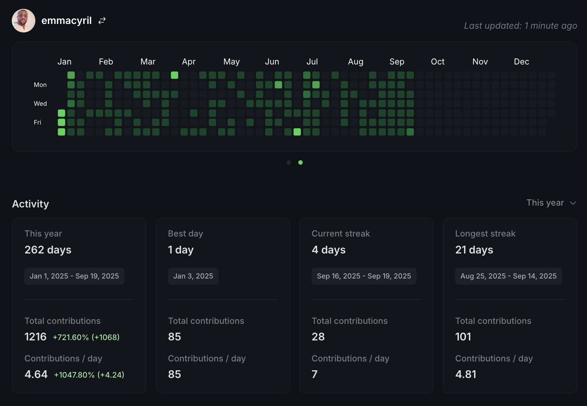

  <h3>🚀 I transform ideas into tech solutions that unlock new revenue streams and cut operational costs. Startup Engineering │ Workflow Optimization │ Consulting.</h3>

---

## 🎯 Professional Summary

> **Innovative Senior Full Stack Engineer** with **12+ years** of expertise in designing, developing, and optimizing enterprise-grade software solutions. Proven track record of **leading technical teams**, **driving digital transformation**, and delivering **high-impact systems** that scale to millions of users.

---

### 💼 Key Achievements

- 🔧 **40% improvement** in system scalability through microservices architecture
- ⚡ **60% reduction** in deployment time with CI/CD implementation
- 💰 **150% increase** in online sales through e-commerce platform optimization
- 🛡️ **75% fraud reduction** with blockchain-based supply chain solutions
- 👥 **Led and mentored a team of developers**, boosting team productivity by **30%**

---

## 📊 GitHub Statistics

---

## 💻 Technical Expertise

### **Core Technologies**

<!-- Skill icons provided by skill-icons. Full icon list and names:
     https://github.com/tandpfun/skill-icons?tab=readme-ov-file#icons-list -->

### **Cloud & DevOps**

  
  

### **Databases & Infrastructure**

 
 

### **Mobile & Emerging Tech**

---

## 🚀 Featured Projects

<table>
  <tr>
    <td align="center" width="33%">
      
       
      <b>Koletmoni</b> 
      A comprehensive digital platform designed to streamline operations and enhance user experience through innovative technology solutions. 
      🔗 <a href="#" target="_blank" rel="noopener noreferrer">Project</a>
       
      Tags: Web Development, Digital Solutions
    </td>
    <td align="center" width="33%">
      
       
      <b>InstantLearn</b> 
      An educational platform revolutionizing learning with instant access to courses and interactive content for modern students. 
      🔗 <a href="#" target="_blank" rel="noopener noreferrer">Project</a>
       
      Tags: EdTech, E-learning, Interactive Platform
    </td>
    <td align="center" width="33%">
      
       
      <b>Qub-Surf</b> 
      Modern cloud cost and performance insights with intuitive dashboards and actionable recommendations. 
      🔗 <a href="https://qubsurf.vercel.app/" target="_blank" rel="noopener noreferrer">Live Demo</a>
       
      Tags: Cloud, FinOps, Analytics, Dashboards
    </td>
  </tr>
  <tr>
    <td align="center" width="33%">
      
       
      <b>JobHunter</b> 
      AI-powered career development platform helping job seekers optimize resumes and find opportunities with intelligent matching. 
      🔗 <a href="https://jobhunteer.vercel.app" target="_blank" rel="noopener noreferrer">Live Demo</a>
       
      Tags: AI, Career Development, ATS
    </td>
    <td align="center" width="33%">
      
       
      <b>Knightsbridge Oasis</b> 
      A premium digital platform offering luxury services and experiences with elegant design and seamless user interface. 
      🔗 <a href="#" target="_blank" rel="noopener noreferrer">Project</a>
       
      Tags: Luxury Services, Web Application
    </td>
    <td align="center" width="33%">
      
       
      <b>RAK Company Ltd</b> 
      Corporate website showcasing business solutions with professional design and comprehensive service offerings. 
      🔗 <a href="#" target="_blank" rel="noopener noreferrer">Project</a>
       
      Tags: Corporate, Business Solutions
    </td>
  </tr>
  <tr>
    <td align="center" width="33%">
      
       
      <b>Afripact</b> 
      Revolutionizing education with data-driven insights and streamlined case management for educational institutions. 
      🔗 <a href="https://admin.afripact.com" target="_blank" rel="noopener noreferrer">Live Demo</a>
       
      Tags: Education, Data Analytics, Management
    </td>
    <td align="center" width="33%">
      
       
      <b>Airbnb Clone</b> 
      A complete frontend clone of Airbnb built with Next.js, featuring modern design and responsive user interface. 
      🔗 <a href="https://airbnbclone-lime-two.vercel.app" target="_blank" rel="noopener noreferrer">Live Demo</a>
       
      Tags: Next.js, Clone, Responsive Design
    </td>
    <td align="center" width="33%">
      
       
      <b>MangoChat - Blockchain Chat</b> 
      Secure blockchain-based messaging platform ensuring transparent and tamper-proof communication with modern UI/UX. 
      🔗 <a href="https://meta-verse-challenge.vercel.app" target="_blank" rel="noopener noreferrer">Live Demo</a>
       
      Tags: Blockchain, Web3, Security, Chat
    </td>
  </tr>
  <tr>
    <td align="center" width="33%">
      
       
      <b>Qub Cloudify</b> 
      Modern cloud management platform built with Next.js, offering seamless cloud resource management and deployment solutions. 
      🔗 <a href="https://qub-cloudify.vercel.app/" target="_blank" rel="noopener noreferrer">Live Demo</a>
       
      Tags: Next.js, Cloud, Web Application
    </td>
    <td align="center" width="33%">
      
       
      <b>Cloudax - Blockchain Ecosystem</b> 
      Decentralized and scalable ecosystem powering the next generation of innovative web3 products and services. 
      🔗 <a href="https://cloudaxwebsite.vercel.app/" target="_blank" rel="noopener noreferrer">Live Demo</a>
       
      Tags: Blockchain, Web3, Decentralized
    </td>
    <td align="center" width="33%">
      
       
      <b>Smoothube - Video Streaming</b> 
      Modern YouTube-inspired platform with Next.js, React, and Tailwind CSS featuring adaptive streaming and real-time communication. 
      🔗 <a href="https://smoothube.vercel.app" target="_blank" rel="noopener noreferrer">Live Demo</a>
       
      Tags: Next.js, React, Video Streaming, WebRTC
    </td>
  </tr>
  <tr>
    <td align="center" width="33%">
      
       
      <b>ReachOut World</b> 
      A platform dedicated to spreading the Rhapsody of Reality globally, connecting communities and sharing inspirational content. 
      🔗 <a href="https://reachoutworld.vercel.app/" target="_blank" rel="noopener noreferrer">Live Demo</a>
       
      Tags: Community, Social Impact, Web Application
    </td>
    <td align="center" width="33%">
      
       
      <b>BH Music Player</b> 
      Modern music streaming platform with a clean, responsive interface for discovering and playing music online. 
      🔗 <a href="https://bhmusicplayer.vercel.app/" target="_blank" rel="noopener noreferrer">Live Demo</a>
       
      Tags: Music, Streaming, React, Web App
    </td>
    <td align="center" width="33%">
      
       
      <b>Chat with PDF AI</b> 
      AI-powered application that allows users to interact with PDF documents through natural language conversations. 
      🔗 <a href="https://chat-with-pdf-challenge-five.vercel.app/" target="_blank" rel="noopener noreferrer">Live Demo</a>
       
      Tags: AI, PDF, Chat, Next.js
    </td>
  </tr>
  <tr>
    <td align="center" width="33%">
      
       
      <b>Torain</b> 
      Agricultural technology platform connecting farmers with markets and providing modern farming solutions. 
      🔗 <a href="#" target="_blank" rel="noopener noreferrer">Project</a>
       
      Tags: AgriTech, Farming, Marketplace
    </td>
    <td align="center" width="33%">
      
       
      <b>GetPower</b> 
      Electricity service platform enabling users to purchase power conveniently with reliable and fast transactions. 
      🔗 <a href="#" target="_blank" rel="noopener noreferrer">Project</a>
       
      Tags: Electricity, Utility Services, Payments
    </td>
    <td align="center" width="33%">
      
       
      <b>Detroinic</b> 
      Comprehensive digital solutions platform offering free usage models and innovative technology services. 
      🔗 <a href="#" target="_blank" rel="noopener noreferrer">Project</a>
       
      Tags: Digital Solutions, Technology Services
    </td>
  </tr>
  <tr>
    <td align="center" width="33%">
      
       
      <b>Streaming Platform</b> 
      Advanced live streaming solution with real-time video processing and user engagement features for content creators. 
      🔗 <a href="#" target="_blank" rel="noopener noreferrer">Project</a>
       
      Tags: Live Streaming, Video Processing, Real-time
    </td>
    <td align="center" width="33%">
      
       
      <b>WinWin Fund</b> 
      Mobile banking application providing financial services with secure transactions and user-friendly interface. 
      🔗 <a href="#" target="_blank" rel="noopener noreferrer">Project</a>
       
      Tags: Mobile Banking, Fintech, Finance
    </td>
    <td align="center" width="33%">
      
       
      <b>CEPAY - Fintech Solution</b> 
      Cutting-edge mobile application for digital currency exchange with blockchain integration and secure financial transactions. 
      🔗 <a href="https://beta.cepay.me" target="_blank" rel="noopener noreferrer">Live Demo</a>
       
      Tags: Fintech, Blockchain, React Native
    </td>
  </tr>
  <tr>
    <td align="center" width="33%">
      
       
      <b>Car Rental Application</b> 
      User-friendly car rental platform with React.js, Redux, and modern web technologies for seamless booking experience. 
      🔗 <a href="https://car-rent-seven.vercel.app" target="_blank" rel="noopener noreferrer">Live Demo</a>
       
      Tags: React.js, Redux, Web Application
    </td>
  </tr>
</table>

---

## 🏆 Awards & Recognition

- **🏆 Web/Mobile Developer of the Year 2023** - Presidential Award (Mid-Level)
- **🥇 Staff of the Year 2022** - Departmental Excellence Award
- **📈 Innovation Leadership Award** - Digital Transformation Excellence
- **👨‍💻 Technical Excellence Award** - Full Stack Development Innovation

---

## 🧩 How I Can Help

- Full‑stack Product Development — From Figma to production (Next.js, Node, React Native, AWS).
- Fractional CTO / Tech Leadership — Roadmaps, architecture, build vs. buy, hiring, coaching.
- Performance & Cost Optimization — Profiling, caching, edge/CDN, infra right‑sizing, DB tuning.
- AI & Data Integrations — LLMs, RAG, analytics pipelines, event-driven architectures.
- Web3/Fintech — Wallets, payments, KYC, compliance-friendly flows.

## 🤝 Let's Connect

- Have a product to ship, scale, or de‑risk? Let’s talk. I'm passionate about **building innovative solutions**, **mentoring developers**, and **driving technical excellence**.

- Email: [Contact me](mailto:eminify+github@gmail.com){:target="_blank"}
- Portfolio: [Portfolio Website](https://emmacyril.eminify.com/){:target="_blank"}
- Book a 15‑min intro: [Schedule a call](https://calendly.com/emmacyril/15min){:target="_blank"}

---

## 🔗 Professional Network

{:target="_blank"}
{:target="_blank"}
{:target="_blank"}
{:target="_blank"}

---

  <i>💡 "To me, every challenge is a canvas. The more complex the problem, the more exciting the opportunity to create something truly transformative. My passion is turning that complexity into solutions that are not only scalable and reliable, but also elegant, intuitive, and built to inspire confidence."</i>

